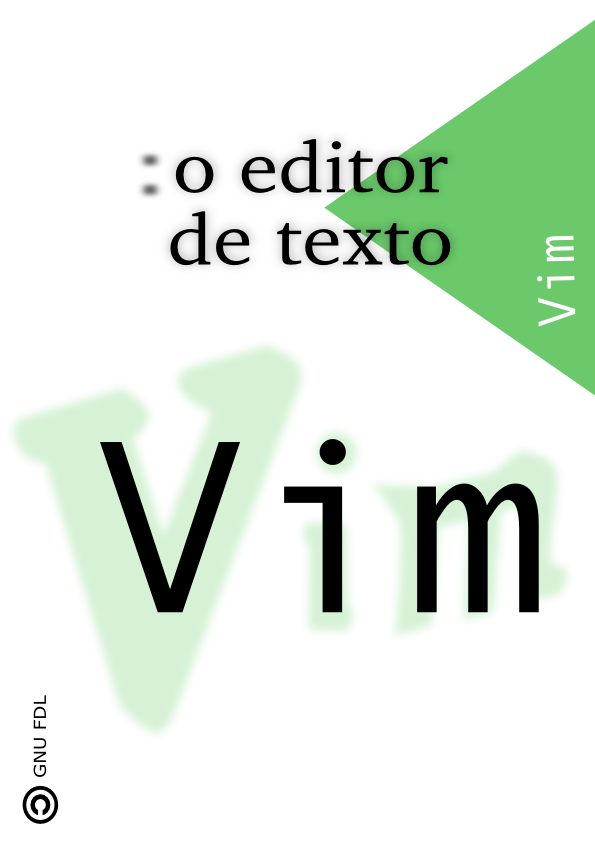
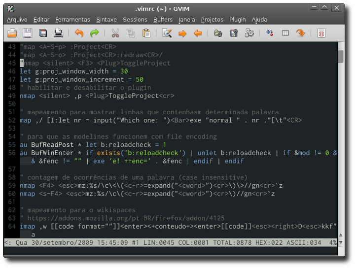

# O EDITOR DE TEXTO VIM

"Um livro escrito em português sobre o editor de texto **Vim**. A ideia é que este material cresça e torne-se uma referência confiável e prática. Use este livro no termos da *Licença de Documentação Livre GNU (GFDL)*."

Este trabalho está em constante aprimoramento e é fruto da colaboração de voluntários. Participe do desenvolvimento enviando sugestões e melhorias; acesse o site do projeto no endereço: [https://github.com/cassiobotaro/vimbook](https://github.com/cassiobotaro/vimbook)

# Regras para contribuição

[Veja como contribuir para o projeto](https://github.com/cassiobotaro/vimbook/blob/main/CONTRIBUTING.md)
